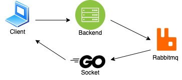

# Prototype
## 레빗엠큐와 소켓을 통해서 사용자들에게 메시지를 전달하는 예시 입니다.



## 준비

publisher, pingpong 서버 연결

```sh
publisher 폴더로 들어가서 go run *.go #localhost:8080
pingpong 폴더로 들어가서 go run *.go #localhost:8082
```


레빗엠큐 테스트 계정 생성, 권한 추가 

1. Add a new/fresh user, say user `test` and password `test`:
    
    ```
    rabbitmqctl add_user test test
    ```
    
2. Give administrative access to the new user:
    
    ```
    rabbitmqctl set_user_tags test administrator
    ```
    
3. Set permission to newly created user:
    
    ```
    rabbitmqctl set_permissions -p / test ".*" ".*" ".*"
    ```


## 테스트
http://127.0.0.1:8080/ping

```sh
http://127.0.0.1:8082/consume/1 #메시지 받음
http://127.0.0.1:8082/consume/3/4 #메시지 받음
```
> cosumer의 path에 상관없이 모두 메시지를 받습니다.

http://127.0.0.1:8080/publish/3

```sh
http://127.0.0.1:8082/consume/1 #메시지 못 받음
http://127.0.0.1:8082/consume/3/4 #메시지 받음
```
> publiser의 첫번째 파라미터가 cosumer의 path 중 첫번째 파라미터와 일치하면 모두 메시지를 받습니다.

http://127.0.0.1:8080/publish/3/4/

```sh
http://127.0.0.1:8082/consume/3/4 #메시지 받음
http://127.0.0.1:8082/consume/3/5 #메시지 못 받음
```
> publiser의 첫번째,두번째 파라미터가 cosumer의 path 중 첫번째, 두번째 파라미터와 일치하면 모두 메시지를 받습니다.